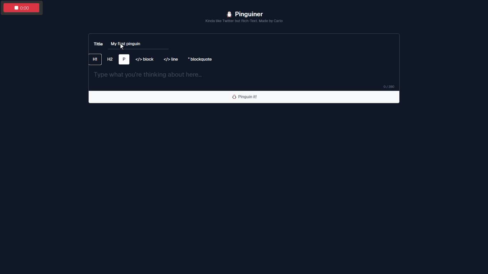

# pinguiner

No auth, kinda like Twitter, but Rich Text. Just playing around with CRUD on
SvelteKit, Form Actions, TipTap (Rich Text Editor), Form Actions, Prisma, SQLite.



### Development

1. Setup

```sh
> $ git clone https://github.com/Blankeos/pinguiner.git
pinguiner> $ cd pinguiner
pinguiner> $ pnpm install
```

2. Database Setup

```
npx primsa generate
npx prisma db push
```

> This is only local. I'm using a file database with sqlite inside the `prisma/`
> folder. You can always create an **.env** variable, add `DATABASE_URL` on it,
> and use `url = env("DATABASE_URL")` in schema.prisma if you want to change.

3. Run the dev server

```
pnpm dev
```

<!--
# create-svelte

Everything you need to build a Svelte project, powered by [`create-svelte`](https://github.com/sveltejs/kit/tree/master/packages/create-svelte).

## Creating a project

If you're seeing this, you've probably already done this step. Congrats!

```bash
# create a new project in the current directory
npm create svelte@latest

# create a new project in my-app
npm create svelte@latest my-app
```

## Developing

Once you've created a project and installed dependencies with `npm install` (or `pnpm install` or `yarn`), start a development server:

```bash
npm run dev

# or start the server and open the app in a new browser tab
npm run dev -- --open
```

## Building

To create a production version of your app:

```bash
npm run build
```

You can preview the production build with `npm run preview`.

> To deploy your app, you may need to install an [adapter](https://kit.svelte.dev/docs/adapters) for your target environment. -->
